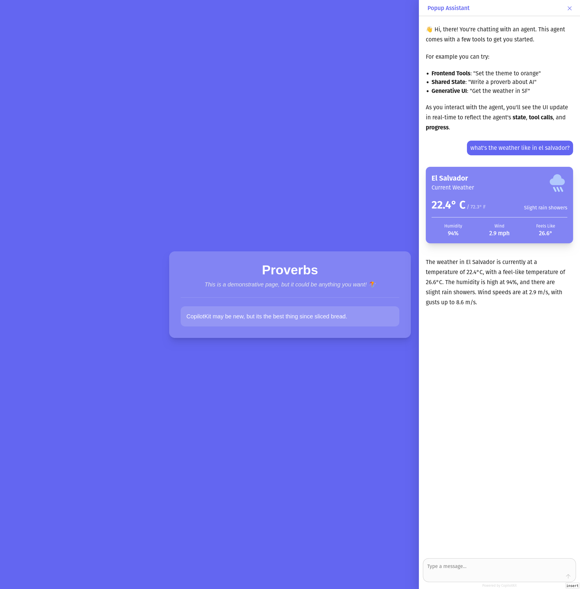

# SokoAnalyst - Elite Financial Markets Intelligence Platform

**SokoAnalyst** is an advanced AI-powered financial markets analyzer built with Mastra AI that provides comprehensive global market analysis, actionable investment insights, and sophisticated risk management across multiple asset classes including stocks, cryptocurrencies, forex, and commodities.



## 🚀 Key Features

### 🌍 Global Market Analysis

- **Multi-Asset Coverage**: Stocks, crypto, forex, commodities across all major markets
- **Real-time Data Processing**: Live price feeds via MCP Perplexity integration
- **Cross-Asset Correlations**: Identify relationships and arbitrage opportunities
- **Market Regime Detection**: Automatically identify bull/bear markets and crisis periods

### 📊 Advanced Technical Analysis

- **Comprehensive Indicators**: RSI, MACD, Bollinger Bands, Stochastic, Volume Analysis
- **Pattern Recognition**: Chart patterns, support/resistance levels, trend analysis
- **Multi-timeframe Analysis**: From intraday to long-term trend identification
- **Signal Generation**: Clear buy/sell/hold recommendations with confidence scores

### 🧠 Sentiment & News Analysis

- **Multi-source Sentiment**: News, social media, options flow, futures positioning
- **Real-time Monitoring**: Track sentiment shifts via MCP-powered news analysis
- **Institutional Flow Analysis**: Smart money movements and whale tracking
- **Fear & Greed Index**: Market emotion quantification and contrarian signals

### 💼 Portfolio Management

- **Performance Analytics**: Risk-adjusted returns, Sharpe ratios, alpha/beta analysis
- **Risk Management**: VaR, Expected Shortfall, stress testing, scenario analysis
- **Diversification Analysis**: Sector, geographic, and asset class allocation
- **Rebalancing Recommendations**: AI-powered optimization suggestions

### ⛓️ Blockchain & Crypto Analytics

- **On-chain Metrics**: Active addresses, transaction volumes, network health
- **DeFi Analytics**: TVL, yield farming, liquidity analysis, protocol revenues
- **NFT Market Analysis**: Floor prices, volume trends, holder distribution
- **Development Activity**: GitHub commits, developer engagement, ecosystem growth

## 🛠️ Technology Stack

- **AI Framework**: Mastra AI for agent orchestration and tool management
- **MCP Integration**: Model Context Protocol for real-time data via Perplexity
- **Frontend**: Next.js 15 with React 19 and TypeScript
- **Styling**: Tailwind CSS with custom financial UI components
- **Backend**: Next.js API routes with comprehensive financial data processing
- **Memory**: LibSQL for agent state management and historical analysis
- **Model Integration**: Ollama for local LLM inference with Qwen models

## 🚀 Quick Start

### Prerequisites

- Node.js 18+ and pnpm
- Ollama installed locally (or remote endpoint)
- MCP servers configured (Perplexity, Fetch, Filesystem)
- Environment variables configured

### Installation

1. **Clone and Install**

   ```bash
   git clone <repository-url>
   cd agent-challenge
   pnpm install
   ```

2. **Environment Setup**

   ```bash
   cp .env.example .env
   # Configure your API keys and endpoints
   ```

3. **MCP Configuration**

   The app uses MCP (Model Context Protocol) for real-time data. Configure in `.kiro/settings/mcp.json`:

   ```json
   {
     "mcpServers": {
       "perplexity": {
         "command": "uvx",
         "args": ["perplexity-mcp-server@latest"],
         "env": {
           "PERPLEXITY_API_KEY": "your_perplexity_key"
         },
         "disabled": false,
         "autoApprove": ["search", "web_search"]
       }
     }
   }
   ```

4. **Start Development**

   ```bash
   # Start the agent backend
   pnpm run dev:agent

   # Start the UI (in another terminal)
   pnpm run dev:ui
   ```

5. **Access SokoAnalyst**
   - Main Dashboard: `http://localhost:3000`
   - SokoAnalyst Dashboard: `http://localhost:3000/soko`
   - Agent API: `http://localhost:3000/api/soko/agent`

## 📋 API Endpoints

### SokoAnalyst Agent

- `POST /api/soko/agent` - Direct agent queries and analysis
- `GET /api/soko/agent?action=status` - Agent status and capabilities

### Market Data & Analysis

- `POST /api/soko/market-data` - Fetch real-time market data via MCP
- `POST /api/soko/technical-analysis` - Perform technical analysis
- `POST /api/soko/sentiment` - Analyze market sentiment
- `POST /api/soko/portfolio` - Portfolio analysis and optimization

## 🎯 Usage Examples

### Market Analysis Query

```javascript
// Query the SokoAnalyst agent
const response = await fetch("/api/soko/agent", {
  method: "POST",
  headers: { "Content-Type": "application/json" },
  body: JSON.stringify({
    query:
      "Analyze the current Bitcoin market conditions and provide actionable trading recommendations",
    context: { timeframe: "1d", riskTolerance: "moderate" },
  }),
});
```

### Technical Analysis

```javascript
// Get technical indicators for a symbol
const analysis = await fetch("/api/soko/technical-analysis", {
  method: "POST",
  headers: { "Content-Type": "application/json" },
  body: JSON.stringify({
    symbol: "AAPL",
    indicators: ["RSI", "MACD", "BB"],
    period: 14,
  }),
});
```

### Portfolio Optimization

```javascript
// Analyze portfolio risk and get recommendations
const portfolio = await fetch("/api/soko/portfolio", {
  method: "POST",
  headers: { "Content-Type": "application/json" },
  body: JSON.stringify({
    holdings: [
      { symbol: "AAPL", quantity: 10, avgCost: 150 },
      { symbol: "BTC-USD", quantity: 0.5, avgCost: 45000 },
    ],
  }),
});
```

## 🔧 Configuration

### Environment Variables

```env
# Ollama Configuration
OLLAMA_API_URL=http://localhost:11434
MODEL_NAME_AT_ENDPOINT=qwen3:8b

# Nosana Configuration (if using Nosana compute)
NOS_OLLAMA_API_URL=your_nosana_endpoint
NOS_MODEL_NAME_AT_ENDPOINT=your_model

# MCP Configuration
PERPLEXITY_API_KEY=your_perplexity_key

# API Keys (for production integrations)
ALPHA_VANTAGE_API_KEY=your_key
YAHOO_FINANCE_API_KEY=your_key
```

### Agent Configuration

The SokoAnalyst agent can be customized in `src/mastra/agents/sokoAnalyst.ts`:

- **Model Selection**: Choose between different LLM models
- **Tool Configuration**: Enable/disable specific analysis tools
- **Memory Settings**: Configure state persistence and working memory
- **Risk Parameters**: Set default risk tolerance and analysis parameters

## 📊 Dashboard Features

### Market Overview

- **Real-time Heatmap**: Visual representation of market performance
- **Multi-asset Tracking**: Stocks, crypto, forex, commodities in one view
- **Quick Analysis**: Click any asset for instant technical analysis

### Technical Analysis

- **Comprehensive Indicators**: Full suite of technical analysis tools
- **Signal Confidence**: Each signal comes with confidence scoring
- **Multi-timeframe Views**: Analyze across different time horizons

### Sentiment Analysis

- **Sentiment Gauges**: Visual representation of market sentiment
- **Multi-source Data**: News, social media, options, futures via MCP
- **Trend Detection**: Identify sentiment shifts and reversals

### Portfolio Management

- **Performance Tracking**: Real-time portfolio valuation and returns
- **Risk Analytics**: Comprehensive risk metrics and stress testing
- **Optimization Suggestions**: AI-powered rebalancing recommendations

## 🔮 MCP Integration

SokoAnalyst leverages Model Context Protocol (MCP) for real-time data access:

### Configured MCP Servers

- **Perplexity**: Real-time web search for market data and news
- **Fetch**: HTTP requests for API endpoints
- **Filesystem**: File operations for data storage

### MCP-Powered Tools

- `mcpMarketDataTool`: Real-time market data via Perplexity search
- `mcpMarketNewsTool`: Latest news and sentiment analysis
- `mcpEconomicIndicatorsTool`: Economic indicators and macro data

### Benefits

- **Real-time Data**: Current market prices and news
- **No API Limits**: Avoid rate limits of traditional APIs
- **Comprehensive Coverage**: Access to web-scale information
- **Cost Effective**: Reduce API costs
- **Flexible Queries**: Natural language queries for complex data

## 🚀 Deployment on Nosana

### Docker Configuration

The project includes a comprehensive Dockerfile that packages:

- SokoAnalyst agent with all financial tools
- Next.js frontend with interactive dashboards
- Ollama LLM for local inference
- All dependencies and configurations

### Nosana Job Definition

```json
{
  "version": "1.0",
  "type": "container",
  "meta": { "trigger": "cli" },
  "spec": {
    "image": "yourusername/sokoanalyst:latest",
    "gpu": "any",
    "resources": {
      "cpu": 2,
      "memory": "8Gi",
      "gpu": 1
    },
    "expose": [{ "port": 3000, "as": 80, "to": ["0.0.0.0/0"] }]
  }
}
```

### Deployment Steps

1. **Build Docker Image**:

   ```bash
   docker build -t yourusername/sokoanalyst:latest .
   docker push yourusername/sokoanalyst:latest
   ```

2. **Deploy to Nosana**:
   ```bash
   nosana job post --file ./nos_job_def/sokoanalyst_nosana_job.json --market nvidia-3090
   ```

## 🛡️ Risk Management

### Comprehensive Risk Metrics

- **Value at Risk (VaR)**: Quantify potential losses
- **Expected Shortfall**: Tail risk analysis
- **Stress Testing**: Scenario-based risk assessment
- **Correlation Analysis**: Identify concentration risks

### Portfolio Optimization

- **Mean Reversion Strategies**: Identify oversold/overbought conditions
- **Momentum Strategies**: Trend-following recommendations
- **Hedging Strategies**: Risk mitigation through derivatives
- **Diversification Analysis**: Optimal asset allocation suggestions

## 🎯 Real-World Applications

### For Individual Investors

- **Portfolio Optimization**: AI-driven asset allocation and rebalancing
- **Risk Assessment**: Comprehensive risk analysis and stress testing
- **Market Timing**: Technical and sentiment-based entry/exit signals
- **Educational Insights**: Learn from AI-generated market analysis

### For Financial Advisors

- **Client Portfolio Management**: Multi-client portfolio analysis
- **Risk Reporting**: Comprehensive risk reports and scenario analysis
- **Market Research**: AI-powered market insights and trend analysis
- **Compliance Monitoring**: Risk-based compliance reporting

### For Institutional Investors

- **Quantitative Analysis**: Advanced statistical and ML models
- **Risk Management**: Enterprise-level risk assessment
- **Cross-Asset Strategy**: Multi-asset class investment strategies
- **Performance Attribution**: Detailed performance analysis

## 🤝 Contributing

We welcome contributions to enhance SokoAnalyst's capabilities:

1. **Fork the repository**
2. **Create a feature branch**: `git checkout -b feature/amazing-feature`
3. **Commit changes**: `git commit -m 'Add amazing feature'`
4. **Push to branch**: `git push origin feature/amazing-feature`
5. **Open a Pull Request**

### Development Guidelines

- Follow TypeScript best practices
- Add comprehensive tests for new features
- Update documentation for API changes
- Ensure responsive design for UI components

## 📄 License

This project is licensed under the MIT License - see the [LICENSE](LICENSE) file for details.

## 🙏 Acknowledgments

- **Mastra AI** for the powerful agent framework
- **Nosana Network** for decentralized compute infrastructure
- **Ollama** for local LLM inference capabilities
- **Model Context Protocol** for real-time data integration
- **Next.js** and **React** teams for the excellent development framework

---

**SokoAnalyst** - Empowering traders and investors with AI-driven market intelligence and actionable insights across global financial markets.

_Built with ❤️ using Mastra AI, MCP integration, and deployed on the Nosana decentralized compute network._
